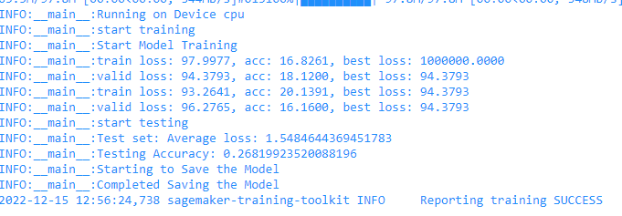
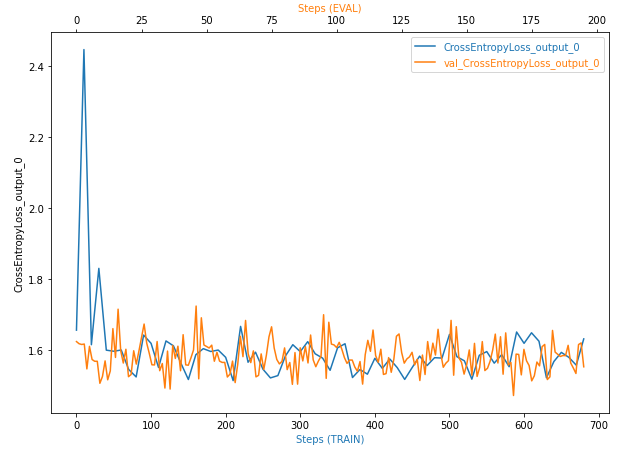
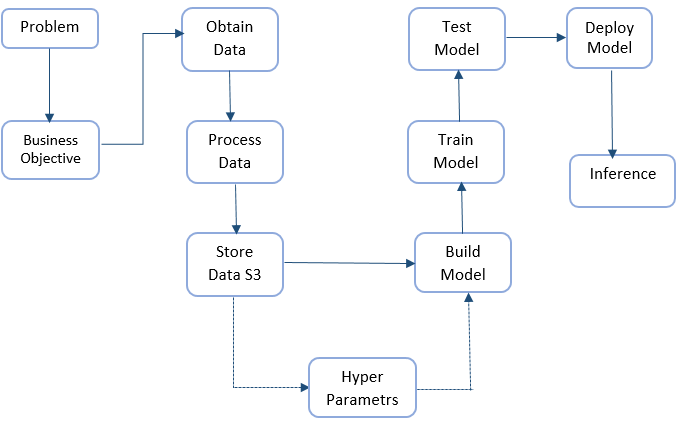
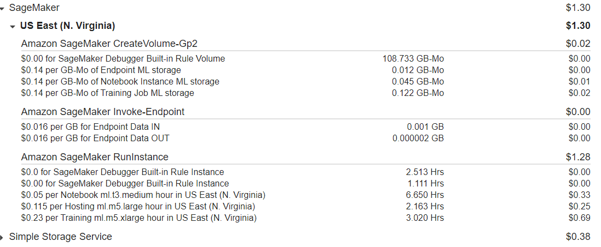

# Inventory Monitoring at Distribution Centers

Amazon fulfillment centers play an important role for delivering products in whole world, they are bustling hubs of innovation that allow Amazon to deliver millions of products to over 100 countries worldwide. These products placed randomly in bins, which are carried by robots. Occasionally, items are misplaced while being handled, resulting in a mismatch: the recorded bin inventory, versus its actual content. In this project, we present methods to detect or predict the number of items in bin. We are using deep learning approach to build model capable to classify bin images based on the number of items in it.

## Project Set Up and Installation
For runing this project :
- Open AWS sageMaker studio or notebook.
- Clone github repo of this project
- Upload files to your workspace
- Run the notebook sageMaker.ipynb.

## Dataset

### Overview
The data used for this project is Amazon Bin Image Dataset contains over 500,000 images and metadata from bins of a pod in an operating Amazon Fulfillment Center. The bin images in this dataset are captured as robot units carry pods as part of normal Amazon Fulfillment Center operations.

### Access
you can access to data here [https://registry.opendata.aws/amazon-bin-imagery/](https://registry.opendata.aws/amazon-bin-imagery/).
In sagemaker.ipynb notebook you found function name **download_and_arrange_data**, this function downloads training data and arranges it in subfolders. Each of these subfolders contain images where the number of objects is equal to the name of the folder.

## Model Training

the model is build using the convolution neural network architecture (CNN).

we used a Pre-Trained model **resnet50** with two layer linear nn fully connected. the resnet50 model is between of the top models classification for image multiclass, resNet50 Is 50 layers deep and is trained on a million images of 1000 categories from the ImageNet database. the optimizer used is - -Adam from torch.optim.
- the hyperParameters identified for training are :
- learning rate for adam optimizer: help to control how quickly the model is adapted to the problem.
- batch-size is a number of samples processed before the model is updated.
- epoch is the number of complete passes through the training dataset.

This hyperparameters are the most parameters that can dramtically affect the performance of the trained models,and lead to the best results.
- model results :

## Machine Learning Pipeline

## Standout Suggestions

For mininze the cost we choose an instance type with lower price. we can also run or build our model in EC2 which has a lowest cost than sagemaker instance. the image below shows our facture.

